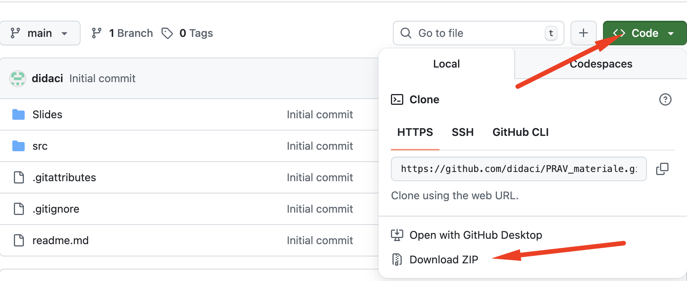
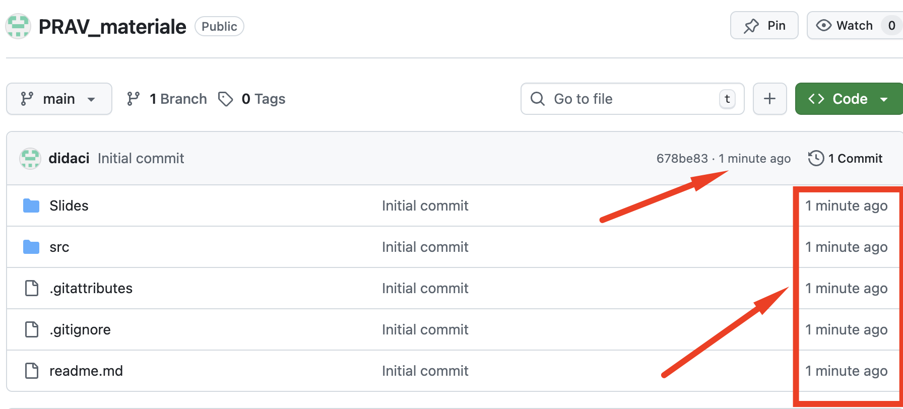

# [IA/0283] PROGRAMMAZIONE AVANZATA
Corso di Laurea: INGEGNERIA ELETTRONICA, INFORMATICA E DELLE TELECOMUNICAZIONI

---

## Accesso al materiale didattico

Il materiale didattico (dispense e codice Python) è disponibile tramite questo repository.

Codice -> `src`

Slides -> `Slides`

### Modalità standard (consigliata)

È possibile scaricare l’intero contenuto tramite file **ZIP**, che include tutti i materiali aggiornati.

---

---

Si segnala che il repository viene aggiornato progressivamente.
Si invitano pertanto gli studenti a verificare la **data dell’ultimo aggiornamento** e, se necessario, a scaricare nuovamente il file ZIP.

---

---

Questa modalità è pienamente sufficiente ai fini del corso.

---

### Modalità avanzata (facoltativa)

Gli studenti che desiderano adottare una gestione più strutturata possono clonare il repository tramite Git.

Tale modalità richiede autonomia nella gestione degli strumenti di versionamento e non costituisce requisito obbligatorio del corso.

--- 